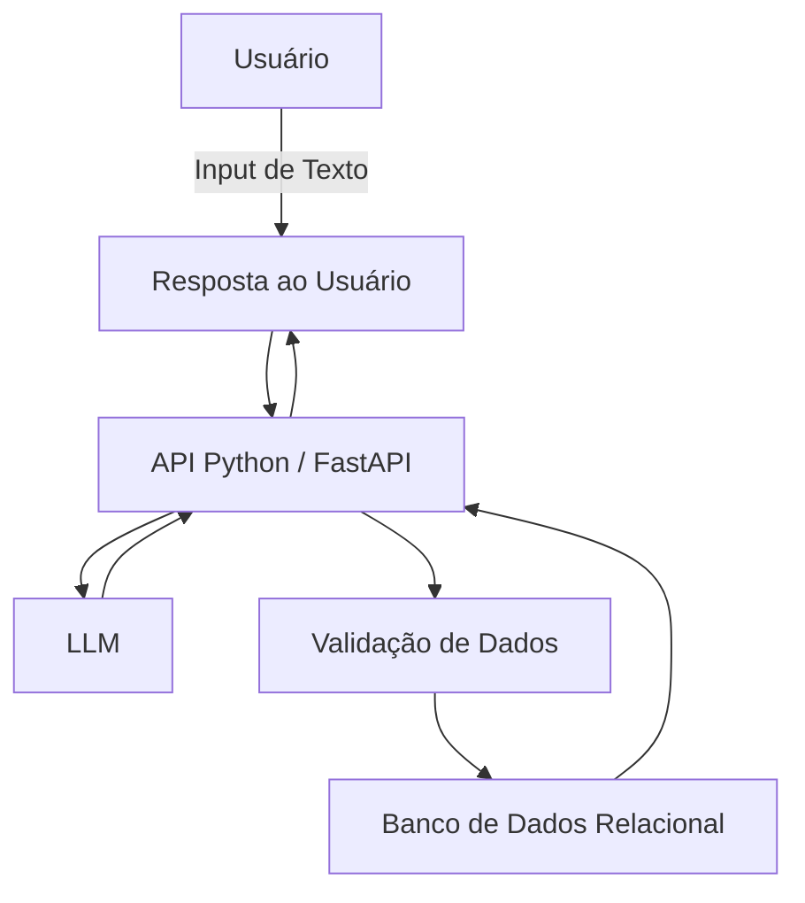

# Documentação do Agente

## Caso de Uso

### Problema
> Qual problema financeiro seu agente resolve?

A fricção e a preguiça de abrir um aplicativo complexo ou uma planilha de Excel toda vez que se faz uma pequena compra no dia a dia, levando à perda do controle financeiro.

### Solução
> Como o agente resolve esse problema de forma proativa?

O agente está online o tempo todo. Basta mandar um texto rápido e ele resolve toda a categorização silenciosamente, avisando apenas se o orçamento daquela categoria estiver estourando.

### Público-Alvo
> Quem vai usar esse agente?

Estudantes e trabalhadores com rotina corrida que precisam de um método sem atrito para anotar gastos diários no momento em que eles acontecem.

---

## Persona e Tom de Voz

### Nome do Agente
CentavoBot

### Personalidade
> Como o agente se comporta? (ex: consultivo, direto, educativo)

Descontraído, motivador, rápido e direto ao ponto. 

### Tom de Comunicação
> Formal, informal, técnico, acessível?

Informal, ágil e acessível. Usa emojis e linguagem do dia a dia.

### Exemplos de Linguagem
- Saudação: "Opa! Tudo certo? Mandou, anotou. Qual foi o gasto de hoje?"
- Confirmação: "Feito! 🍕 Categoria Alimentação atualizada (R$ 45,00)."
- Erro/Limitação: "Vish, me perdi aqui. Você gastou isso em quê exatamente?"

---

## Arquitetura

### Diagrama

### Componentes

| Componente | Descrição |
|------------|-----------|
| Interface | Interface web em Vue.js |
| LLM | API do modelo generativo configurada para retornar estruturação em JSON (Function Calling). |
| Base de Conhecimento | Arquivos locais (CSV/JSON). Ideal para armazenar sessões rápidas, facilitando a portabilidade. |
| Validação | Uso da biblioteca Pandas para tratar o JSON recebido da IA, converter tipos e adicionar as linhas ao arquivo CSV. |

---

## Segurança e Anti-Alucinação

### Estratégias Adotadas

- [X] Limita as respostas a um máximo de 3 linhas de texto para evitar gerações prolongadas e alucinadas.
- [X] Sempre repete o valor numérico entendido pela IA na resposta para o usuário validar visualmente.
- [X] Caso o LLM invente uma categoria que não existe no banco, o backend aplica um fallback (plano B) e joga para "Outros".
- [X] Sem memória de longo prazo desnecessária no chat; o histórico real de verdade é o banco de dados.

### Limitações Declaradas
> O que o agente NÃO faz?

O agente não projeta lucros, não faz cálculos de juros compostos de dívidas e não gera imagens ou gráficos dentro do chat.
